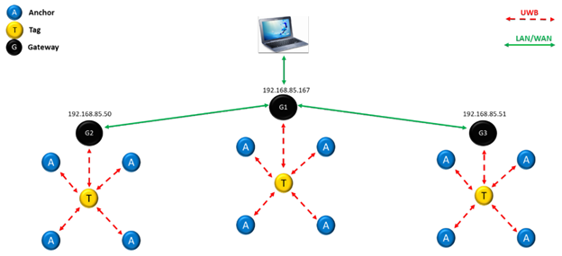

# Real Time Location System Project

Real Time Location Systems (RTLS) uses active objects to hold state of each tag and anchor in the system. With this project, the whole system will be implemented using C++. 

## System Overview

In an RTLS network, there are three main components and these are;
- *Tags* : Moving objects we would like to track. 
- *Anchors*: Static objects that are placed in the environment that communicates with tags to give relative position of the tag.
- *Gateways*: Main controllers that have positioning algorithms, MQTT broker and internet connection.

Mainly, Ultra Wide-Band (UWB) technology is used for communication between these objects. In the end, Gateway objects will process the data and take action accordingly. An example structure is given below.



## Project Structure

Code written will be working on gateway devices. Devices used will replicate  [DWM1001C](https://www.qorvo.com/products/p/DWM1001-DEV) devices. The gateway device runs an MQTT broker and publishes messages from anchors and tags to certain topics. Example messages are given as below.

When tag and anchors send message to gateway, it will be in the topic "*/uplink/*". When gateway wants to send message to a node (a tag or an anchor), it sends to "*/downlink/*" topic.
There are location,config,status and data topics that could be send and received. It can be found from [DWM1001 Gateway Quick Deployment Guide](https://www.qorvo.com/products/d/da007973)

A node can send the following location data:
```
TOPIC: dwm/node/<node_id>/uplink/location
MESSAGE: 
{
  "position" : {
    "x" : 0.3,
    "y" : 3.5,
    "z" : 1,
    "quality" : 80
  },
  "superFrameNumber" : 1150
}
```
A node state can be configured with downlink message such as:
```
TOPIC: dwm/node/<node_id>/downlink/data
MESSAGE: 
{
  "data":"state_0",
  "overwrite":false
}
```
When a node enters or leaves, following message will be sent.
```
TOPIC: dwm/node/<node_id>/uplink/status
MESSAGE: 
{
  "present" : false
}
```

We will analyze the messages and change states of the tags.

## Roadmap
- [ ] Basic structure of the project files
- [ ] Tag, anchor device state machines definitions
- [ ] Test files of tag and anchor devices using [gtest](https://google.github.io/googletest/)
- [ ] Message generor object that randomly generates MQTT messages from tags and anchors
- [ ] Message generotr object that generates messages based on scenraios
- [ ] Visualizing the objects using OpenCV
- [ ] Socket implementation between gateway device for visualization 